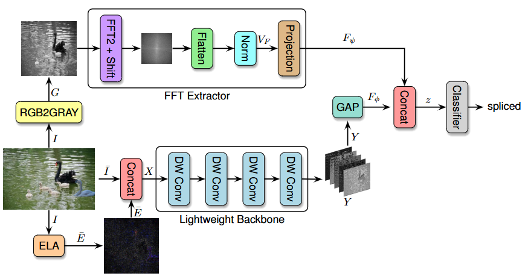
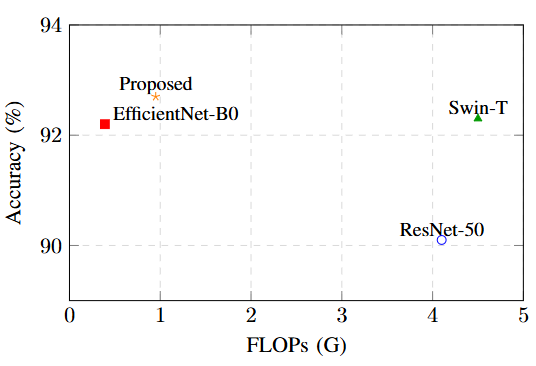
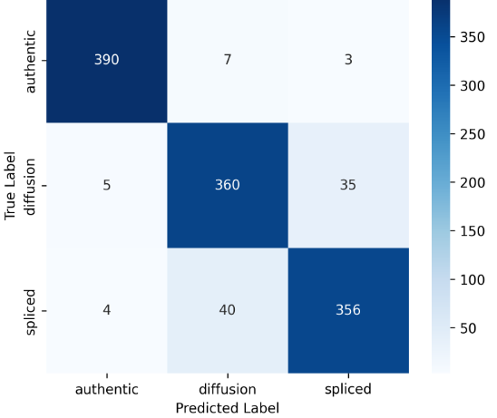
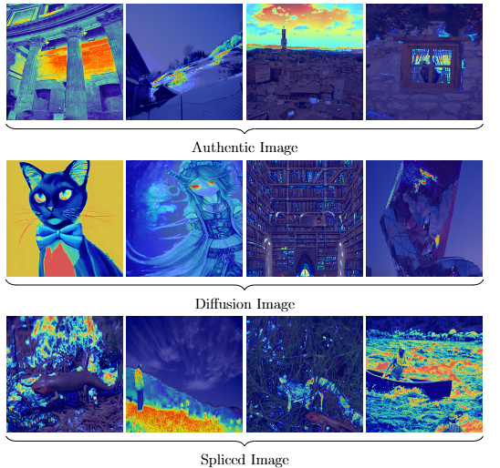

## Combining ELA and Frequency Analysis for Robust Classification of Authentic, Spliced and Diffusion Images

### Overview



This project classifies images into authentic, spliced, or diffusion‑generated by fusing spatial cues from in‑memory Error Level Analysis (ELA) with frequency cues from a low‑frequency FFT branch; the RGB image is normalized and concatenated with its ELA residual to form a 4‑channel tensor processed by a lightweight depthwise‑separable CNN, while in parallel a grayscale FFT is computed and the centered low‑frequency band is cropped, normalized, and projected to a compact vector, after which both descriptors are concatenated and passed to a small MLP head to produce the final prediction.

---

## Getting started

### Requirements
Install dependencies:

```bash
pip install -r requirements.txt
```

### Data layout
Place datasets under `data/data_name/` using class folders:

```
data/data_name/
  train/
    authentic/  *.jpg|*.png|*.tif
    diffusion/  *.jpg|*.png
    spliced/    *.jpg|*.png
  test/
    authentic/
    diffusion/
    spliced/
```
### Train

```bash
python main.py --cfg_path configs/path.yaml --device cuda --batch-size 8 --epochs 50
```

- Checkpoints and logs are written to `outputs/data_name/`.

### Evaluate

```bash
python main.py --cfg_path configs/path.yaml --device cuda --eval --resume outputs/data_name/best_checkpoint.pth
```

---

### Overall comparison

| Model             | Params (M) | FLOPs (G) | Acc (%) | Prec (%) | Rec (%) |
|-------------------|------------|-----------|---------|----------|---------|
| ResNet-50         | 25.6       | 4.1       | 90.1    | 89.6     | 89.4    |
| EfficientNet-B0   | 5.3        | 0.39      | 92.2    | 91.8     | 91.5    |
| Swin-T            | 29.0       | 4.5       | 92.3    | 91.9     | 91.7    |
| **Proposed**      | **0.394**  | **0.95**  | **92.7**| **92.1** | **92.5**|

- The proposed hybrid achieves the top accuracy with a tiny parameter count, striking an excellent compute–performance trade-off.



### Confusion matrix

The model separates authentic images cleanly and shows limited confusion between diffusion and spliced classes.



### Grad-CAM visualizations

Grad-CAM highlights: authentic images emphasize natural textures/edges; diffusion images reveal over-smooth or uniform regions; spliced images focus on boundaries and inconsistent lighting/shadows.



### Ablation studies

- **ELA quality (Q)**

| Q   | Acc (%)        | Prec (%)       | Rec (%)        |
|-----|----------------|----------------|----------------|
| –   | 88.4 ± 0.6     | 88.0 ± 0.7     | 87.6 ± 0.8     |
| 50  | 90.3 ± 0.5     | 89.8 ± 0.6     | 90.1 ± 0.5     |
| 75  | **92.7 ± 0.4** | **92.1 ± 0.5** | **92.5 ± 0.3** |
| 90  | 92.5 ± 0.4     | 92.0 ± 0.4     | 92.3 ± 0.4     |

- **FFT crop size (K)**

| K  | Acc (%)        | Prec (%)       | Rec (%)        |
|----|----------------|----------------|----------------|
| 8  | 92.0 ± 0.4     | 91.6 ± 0.5     | 91.4 ± 0.6     |
| 16 | **92.7 ± 0.4** | **92.1 ± 0.5** | **92.5 ± 0.3** |
| 32 | 92.6 ± 0.3     | 92.0 ± 0.4     | 92.3 ± 0.3     |
| 64 | 92.3 ± 0.5     | 91.9 ± 0.6     | 92.1 ± 0.5     |

- **Spatial feature dimension ($d_\phi$)**

| $d_\phi$ | Acc (%)        | Prec (%)       | Rec (%)        |
|-----|----------------|----------------|----------------|
| 64  | 89.8 ± 0.7     | 89.2 ± 0.8     | 89.0 ± 0.9     |
| 128 | 91.6 ± 0.5     | 91.1 ± 0.6     | 91.3 ± 0.5     |
| 256 | **92.7 ± 0.4** | **92.1 ± 0.5** | **92.5 ± 0.3** |
| 512 | 92.4 ± 0.4     | 91.9 ± 0.4     | 92.2 ± 0.4     |

- **Fusion strategy**

| Fusion            | Acc (%)        | Prec (%)       | Rec (%)        |
|-------------------|----------------|----------------|----------------|
| Concatenation     | **92.7 ± 0.4** | **92.1 ± 0.5** | **92.5 ± 0.3** |
| Weighted concat   | 92.5 ± 0.3     | 92.0 ± 0.4     | 92.3 ± 0.3     |
| Gated fusion (MLP)| 92.3 ± 0.3     | 91.9 ± 0.3     | 92.1 ± 0.3     |
| Late fusion       | 91.8 ± 0.5     | 91.2 ± 0.6     | 91.5 ± 0.5     |

---


## License

This repository is distributed under the terms of the license in `LICENSE`.


